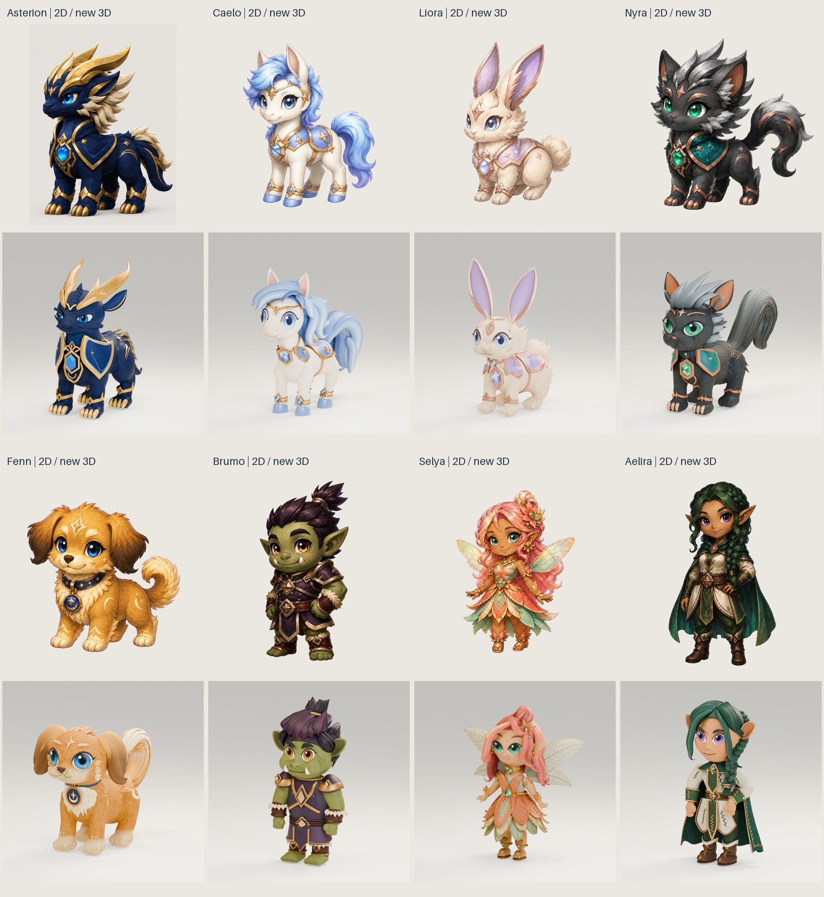

# Reference-likeness round review

Reviewed on 2026-09-06. Asterion uses `sculpt-v005`; the seven other companions
use `sculpt-v004`. These are further editable art studies, **not accepted
100-percent reproductions**. All original artwork and preceding deliveries
remain unchanged.

## Delivered figures

| Figure | Triangles | GLB bytes | Material primitives | Original / previous / new comparison | Source evidence |
| --- | ---: | ---: | ---: | --- | --- |
| Asterion | 3,111,372 | 40,080,216 | 23 | [Comparison](asterion-comparison.jpg) | [Manifest](../../../source/asterion/sculpt-v005/manifest.json) |
| Caelo | 1,102,592 | 12,310,924 | 18 | [Comparison](pony-comparison.jpg) | [Manifest](../../../source/pony/sculpt-v004/manifest.json) |
| Liora | 1,848,286 | 22,700,696 | 22 | [Comparison](rabbit-comparison.jpg) | [Manifest](../../../source/rabbit/sculpt-v004/manifest.json) |
| Nyra | 1,511,978 | 18,389,340 | 13 | [Comparison](cat-comparison.jpg) | [Manifest](../../../source/cat/sculpt-v004/manifest.json) |
| Fenn | 1,564,512 | 18,806,388 | 11 | [Comparison](dog-comparison.jpg) | [Manifest](../../../source/dog/sculpt-v004/manifest.json) |
| Brumo | 1,356,914 | 14,352,680 | 24 | [Comparison](orc-comparison.jpg) | [Manifest](../../../source/orc/sculpt-v004/manifest.json) |
| Selya | 1,492,966 | 15,933,476 | 24 | [Comparison](fairy-comparison.jpg) | [Manifest](../../../source/fairy/sculpt-v004/manifest.json) |
| Aelira | 1,582,994 | 16,679,524 | 28 | [Comparison](elf-comparison.jpg) | [Manifest](../../../source/elf/sculpt-v004/manifest.json) |

The [gallery receipt](gallery-manifest.json) binds the exact original artwork,
previous and new renders, per-figure manifests and review-layout outputs.
Figures are independently framed for legibility, not pixel-aligned or a scale
chart. Asterion's hero illustration is cropped from the supplied four-view
turnaround for this layout only. No illustration is projected onto a mesh.

## Actual shape changes

- **Asterion:** swept-back crown, shortened ears, fuller cheeks/nose and upper
  chest, deeper navy pigment with lower scale relief, fitted rear collar and
  fuller claws. Curved closed-eye covers and supported catchlights replace
  protruding cover geometry. The previous temporary head-mane omission remains;
  consequently the original mane silhouette is deliberately not reproduced.
- **Caelo:** rolled diagonal forelock, shaped neck locks, fuller curled tail,
  coordinated ocular shaping and blue pigment.
- **Liora:** swept ears with fuller rims, rounder haunch, overlapping cheek fur,
  cotton-tail plume and lavender-blue eyes.
- **Nyra:** swept silver crest, triangular ears, softer feline lower face and
  eye surround, curved silver/dark tail silhouette.
- **Fenn:** continuous hanging ears, complete cream chest bib, curled tail,
  warm coat and refitted collar/pendant family.
- **Brumo:** broader compact proportions, raised upper chest and staggered
  plum quiff. Eye geometry stays around its original scale-animation pivots.
- **Selya:** curled copper locks, golden forelock, fitted botanical waist,
  pearl/mint wings and refined layered petals.
- **Aelira:** arched parting, temple curls, softened braid, broader cape folds
  and coordinated cheek/ocular shaping.

These are species-specific geometry and material edits, not subdivision padding.
Fuller volumes can reduce as well as increase triangle count.

## Corrections found during review

Fenn's fuller bib initially intersected the pendant. The complete seven-part
pendant family now has a measured conservative `0.02400005` model-unit gap
over 25,106 bib vertices. The collar-side tab ring is unchanged. The bib was
neither deleted nor hidden to produce this clearance.

Brumo's first proportion draft displaced the eyelid relative to its original
scale pivot. Intermediate-frame review caught this despite a plausible closed
frame. The corrected shape field leaves the entire ocular/head family around
its original pivot and fills the upper chest instead; the original action data
remain exact. This diagnostic does not claim collision-free animation.

Final body-only inspection also exposed inherited flat-ended limb gaps beneath
the outfits. Brumo now has six fitted closed deltoid/wrist/ankle shells; Aelira
has five covering armholes, wrists and the base trouser seat. Each new shell has
exactly two incident faces per edge and finite normalized weights on the
original bones. They remain body components when the outfit is hidden. The
source diagnostic inspected on/off hero and walk-frame-13 views, with finite
evaluated connector geometry at 81 poses per figure. These overlapping closed
shells are not a watertight union of the whole figure or a printing mesh.

Asterion's nonuniform chest field initially made portable hair rings elliptical.
The final field translates complete ring centers, retaining circular radii.
After reopening, all 3,582 native tail strands / 50,148 points match their
portable rings within the required `1e-5` center/radius tolerances. Native hair
has no physics. No head-mane groups were restored. Eye-cover fitting also
prevents the former catchlights from shining through fully closed lids.

## Fresh evidence

- All eight Blender masters saved and reopened; complete original action,
  rest-bone, constraint, driver and frame-rate fingerprints preserved.
- Old and candidate GLBs imported separately. Nine sampled skin-matrix checks
  for each of nine clips per figure pass the `2e-4` tolerance. Positions,
  transforms and normalized known skin weights pass finite-data checks.
- Six source renders and four fresh-import renders per figure cover front,
  side, rear, body-only and blink inspection. Intentional new eye geometry
  survives source reopening.
- Every GLB contains two explicitly classified skinned mesh nodes, one original
  shared skin and nine original clips; no reference images or external buffers.
- `pnpm install --frozen-lockfile`: exit 0, existing lockfile satisfied. The
  optional package-manager update check could not reach its registry; no
  dependency update or replacement was performed.
- `pnpm test`: 86 tests passed, including 19 new likeness tests, actual Three.js
  Meshopt decoding, outfit toggling during animation and historical hashes.
- `pnpm check`: passed. `pnpm build`: local Windows standalone artifact passed.
  This does not establish target-Linux or deployment acceptance.
- `test_delivery.py`: 10 regression tests passed with delivered bytes unchanged.
  Missing/substituted input evidence, arbitrary check sets, contradictory action
  digests, false GLB counts, stale builders and conflicting/raced destinations
  are rejected before delivery.
- `test_gallery.py`: six read-only tests passed, including receipt-bound
  replacement of only the ten layout files, escaped-target rejection and
  destination-race rejection. A second reviewer independently confirmed them.
- `git diff --check`: passed.

## Browser verification

All eight current models reached the ready state in the local in-app browser.
Each actual outfit transitioned visible / zero visible meshes / restored,
with counts recorded in [browser checks](browser-checks.json). Four camera
controls and walk/idle selection were exercised. Aelira's Reduced Motion mode
showed the unchanged 2D illustration and returned to the loaded 3D figure.

After the final body-joint correction and production build, the regenerated
Brumo, Selya and Aelira files were rechecked in a fresh browser tab. All three
again reached ready and passed outfit off/on checks; Brumo and Aelira also had
their body-only views inspected. The recorded final hashes identify these
exact deliveries. This final tab recorded no console errors or warnings and
was left on Caelo's equipped hero view in idle.

The preview recorded no console errors. A nonfatal graphics-driver shader
precision warning was observed; this is not a zero-warning claim. The separate
main-page check reached the login screen and reported the local Auth.js
`MissingSecret` configuration error. No credentials, authentication settings or
ownership behavior were changed, and no authenticated companion action was
claimed as tested.

## Remaining likeness and acceptance limits

Facial character, eye integration, fur transitions, strand layering, painted
highlights and costume richness still differ visibly. Some tails and hair locks
remain too solid or regular compared with the painterly originals. Asterion's
head mane remains intentionally absent and his proportions still need further
art direction. Hidden views for the other seven pets are inferred.

These are high-poly desktop review models. Mobile performance, final human
identity approval, physical hair, new animations, interchangeable reward items,
inventory persistence, database actions, multi-node behavior and deployment
are not accepted by this work. The default 2D feature flag stays off.

See the [production guide](../../../source/companions/sculpt-v004/README.md)
and [figure index](../../../COMPANION-FIGURES.md) for editable files.
