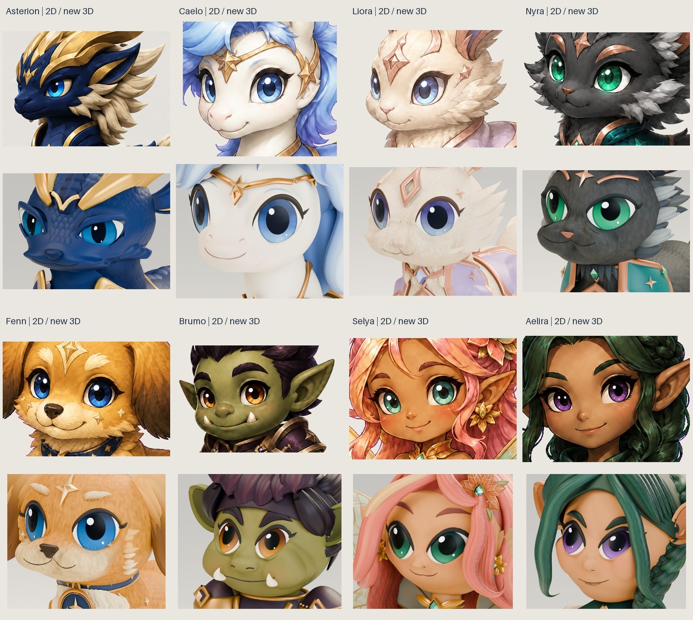

# Face-only refinement review

Review date: 2026-09-06. Asterion uses `sculpt-v006`; the other seven figures use
`sculpt-v005`. Approved illustrations and all preceding source/GLB revisions
remain unchanged. These are further facial sculpture studies, **not accepted
100-percent reproductions**.

## Per-figure comparisons

Each sheet places the approved face, preceding 3D face and new 3D face side by
side. Both 3D panels are fresh GLB imports in the same camera and studio. The
2D crop is independently framed for legibility; this is not a pixel-registration
or numerical likeness score. Layout cropping changes no source image bytes.
The [gallery receipt](gallery-manifest.json) binds every input and output.

| Figure | Facial changes | Original / previous / new | Editable source evidence |
| --- | --- | --- | --- |
| Asterion | Broader deep-blue eyes, thinner brows, fitted orbit, rounded nasal volume, softer cheek/chin and curved lips | [Comparison](asterion-face-comparison.jpg) | [Manifest](../../../source/asterion/sculpt-v006/manifest.json) |
| Caelo | Recessed arched eyes, blue iris, larger pupil, tapered lashes, gentler muzzle and nostrils | [Comparison](pony-face-comparison.jpg) | [Manifest](../../../source/pony/sculpt-v005/manifest.json) |
| Liora | Lavender-blue eyes, connected lower orbit, rounded whisker pads, heart nose and small mouth | [Comparison](rabbit-face-comparison.jpg) | [Manifest](../../../source/rabbit/sculpt-v005/manifest.json) |
| Nyra | Integrated green eyes, richer pupils, softer feline muzzle and attached lash roots | [Comparison](cat-face-comparison.jpg) | [Manifest](../../../source/cat/sculpt-v005/manifest.json) |
| Fenn | Blue eyes, continuous lash tips, connected cream muzzle pads, shaped nose and smile | [Comparison](dog-face-comparison.jpg) | [Manifest](../../../source/dog/sculpt-v005/manifest.json) |
| Brumo | Slimmer orbital margin, amber irises, rounded nose, shorter tusks and seated smile | [Comparison](orc-face-comparison.jpg) | [Manifest](../../../source/orc/sculpt-v005/manifest.json) |
| Selya | Jade irises, rounded warm cheeks/chin, fitted orbital joins and subtle nose/mouth relief | [Comparison](fairy-face-comparison.jpg) | [Manifest](../../../source/fairy/sculpt-v005/manifest.json) |
| Aelira | Violet iris shading, arched ocular contours, seated brows and tapered smile | [Comparison](elf-face-comparison.jpg) | [Manifest](../../../source/elf/sculpt-v005/manifest.json) |

## Scope that did not change

Original body and nonfacial shaders, ears, hair, crown, tail, clothing, armor,
original rig and nine action curves are unchanged. Natural markings, wings and
opaque base clothing remain on the body. The outfit is still a separate mesh
node on the original shared skin. There is no new inventory/reward system.
Asterion's head mane stays intentionally omitted; his native static tail groom
and corresponding portable tubes remain intact.

The source checks compare explicit facial allowlists and all protected geometry
and material-node signatures before, after and after reopening. This caught
and prevented accidental changes through shared facial/body materials. All
original eyelid object names and pivots are preserved.

## Visual corrections made during this round

The review used frontal, three-quarter and profile closeups rather than judging
only whole-body silhouettes. Repeated iterations removed floating brow/lash
roots, excessive raised orbital bands, Liora's under-eye opening, and overly
bright or radial-streaked iris/lid shading. Fenn's disconnected outer lash was
seated against both the skull and orbital skin, not only the skull.

Asterion's old flat nose badge was replaced by a convex rounded triangular
volume; nares and curved lip tubes follow actual surfaces. His lower lid sweep
ends are closed. The eye surround expands toward the bridge and forehead but
narrows at the receding temple to avoid a projecting lateral flange.

Brumo's lower orbital strip was fitted to the actual head boundary. Candidate
full-closure sclera slivers in the humanoid group were rejected and corrected
by fitting lid/cornea geometry, without changing original animation data.

## Verification boundary

Every saved Blender master is reopened and checked. Fresh old/new GLBs have
two independent character mesh nodes, one original skin and nine original
clips, with nine sampled skin-matrix comparisons per clip. Actual decoded
geometry has finite coordinates, known normalized weights and bounded triangle
count differences. All files and required builder inputs are hash-bound.

Each delivery includes nine source images, eight fresh candidate GLB images,
three matched old GLB face images, a manifest and validation report. Source
blink geometry is additionally evaluated at frames 1, 5, 7, 8, 9, 10, 12, 16
and 24. The read-only Node suite independently decodes both GLBs and checks
live outfit toggling while original clips continue. See the
[production contract](../../../source/companions/sculpt-v005/README.md).

Final local checks on 2026-09-06 passed: 103 Node tests, 11 source-guard tests,
16 delivery tests for each of eight figures, six gallery tests, `pnpm check`
and `pnpm build`. All local links in the seven updated Markdown guides resolve.
The development preview loaded all eight new models; each outfit independently
switched off and on while the character canvas stayed ready. All eight served
GLBs matched their delivered file hashes. Asterion's front and profile views,
the existing blink selection, and Reduced Motion's static 2D fallback and return
to 3D were checked. The inspected browser warning/error log was empty. These
checks do not establish Linux deployment, mobile performance or final likeness
acceptance.

The inherited eyelids are laminar covers scaled outwards from their original
centers. Their partial motion is not anatomical; narrow edge exposure can
remain at strict lateral angles. Finite-frame checks and matching animations
do not prove perfect continuous coverage or collision-free movement. A later
animation/topology round is separate from this face-only request.

## Remaining differences

The originals have more painterly surface variation, asymmetric expression and
illustrated light/shadow. Some muzzle, orbit and cheek proportions still differ;
Asterion retains a strongly recessed orbital appearance. Hair, ear and costume
differences remain from the prior round because those parts were excluded.
Unshown views remain interpretations, and the omitted Asterion mane deliberately
does not match the full original silhouette.

Source and browser lighting differ, and the existing lossy Meshopt delivery can
add small shading/edge differences. The assets remain high-poly desktop review
models. Human likeness and representative mobile-performance acceptance are
pending; the standard 2D fallback remains enabled by default. No paid provider,
new reference art, projected portrait, deployment or authentication change is
part of this work.
