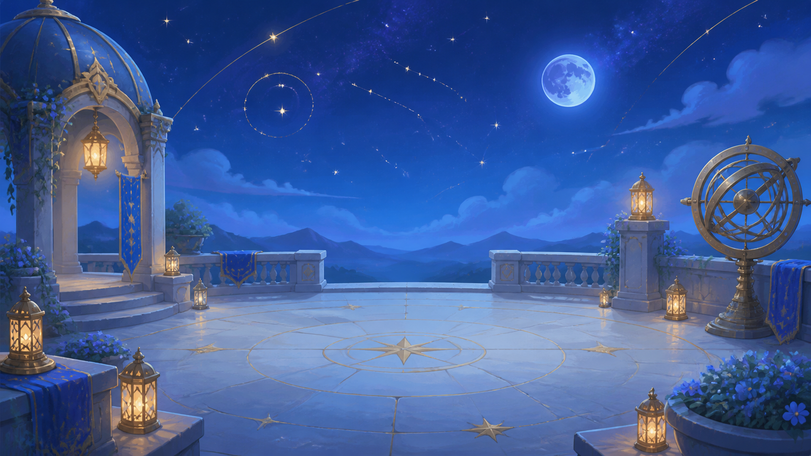
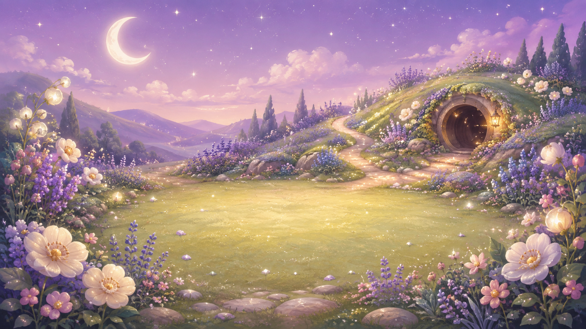
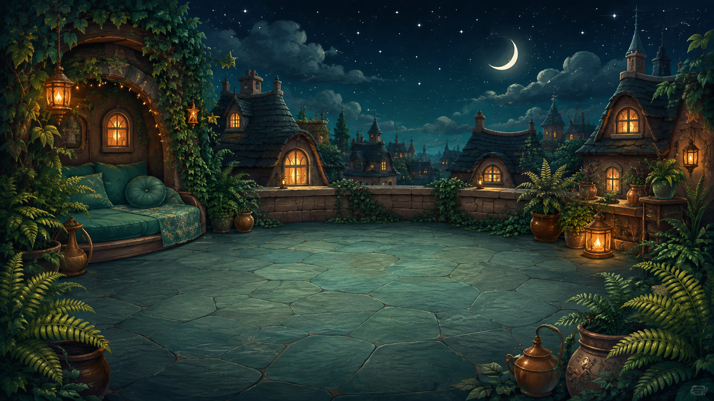
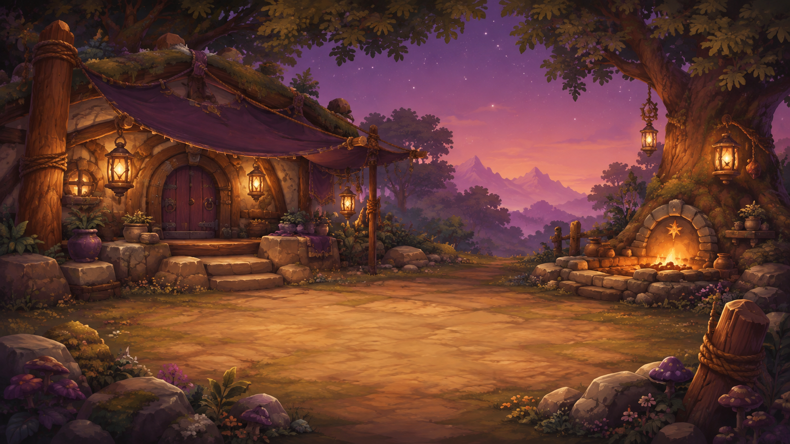
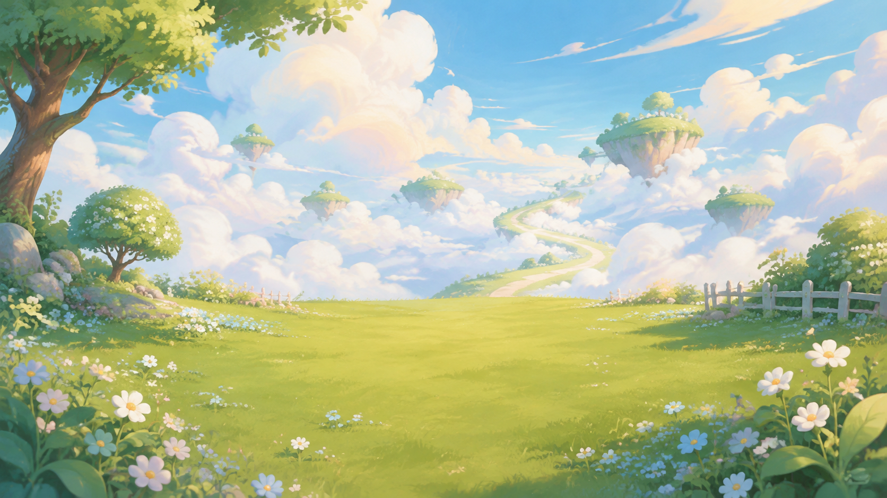
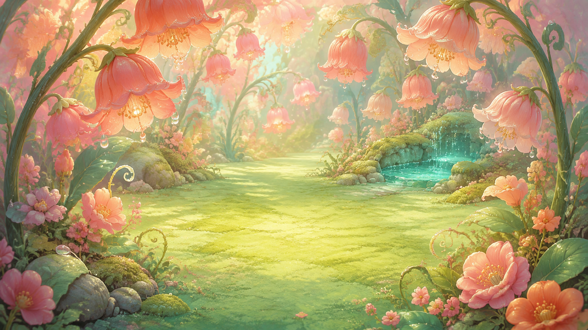
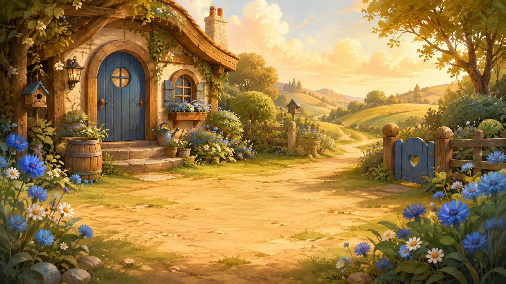
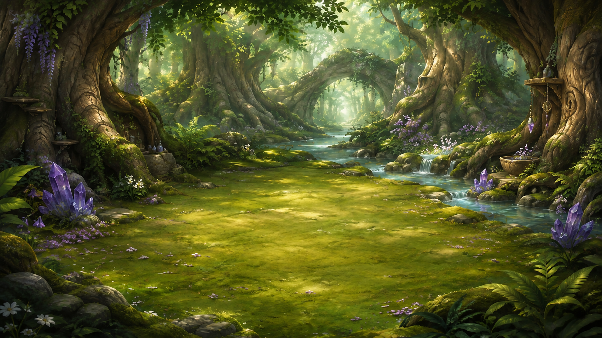

# Companion backgrounds - first image set

Eight independently generated environment backgrounds for the existing companion catalog.
Created on 2026-09-05 with the built-in ImageGen tool. The original companion
portraits and animations were not changed.

## Images

All files are opaque PNGs at **1672 x 941 pixels** (approximately 16:9), retaining
the generated pixels without resizing or lossy conversion. Each scene leaves a
quiet lower-center staging area for a separately rendered companion.

| Companion | Setting | Image |
| --- | --- | --- |
| Asterion (`asterion`) | Celestial observatory | [asterion-background-v1.png](asterion-background-v1.png) |
| Liora (`rabbit`) | Moonlit meadow | [rabbit-background-v1.png](rabbit-background-v1.png) |
| Nyra (`cat`) | Rooftop garden | [cat-background-v1.png](cat-background-v1.png) |
| Brumo (`orc`) | Starfire camp | [orc-background-v1.png](orc-background-v1.png) |
| Caelo (`pony`) | Cloud pasture | [pony-background-v1.png](pony-background-v1.png) |
| Selya (`fairy`) | Blossom garden | [fairy-background-v1.png](fairy-background-v1.png) |
| Fenn (`dog`) | Cottage garden path | [dog-background-v1.png](dog-background-v1.png) |
| Aelira (`elf`) | Whispering woodland | [elf-background-v1.png](elf-background-v1.png) |

## Use and boundaries

The prepared 0.6.0 website candidate now layers these approved images behind the existing companion sprites using responsive `next/image` delivery. The originals remain unchanged; the decorative layer has empty alternative text, ignores pointer events, adds no motion, and retains a solid-color failure fallback. Integration is separate from deployment and mobile performance acceptance.

- These are environment-only backgrounds: no baked-in pets, interface text or logos.
- The settings and palettes are new art proposals inspired by the current profiles,
  not newly established character canon.
- Layer the existing 2D sprite or future 3D view independently. Preserve the approved
  companion identity and the 2D fallback.
- Keep an accessible solid-color fallback and readable interface panels; decorative
  background images should not repeat the companion's accessible image description.
- Responsive crops and character contrast still need checks in the actual interface.
  The full-resolution PNG set is not a browser-performance acceptance result.
- The original artwork delivery added assets and documentation only. The 0.6.0
  candidate integrates the decorative layer; deployment and publication require
  their own recorded evidence.
- Original output is preserved under versioned names. Do not silently replace a
  selected background when producing later variants.

Exact prompts, the elf-only lettering correction, dimensions, byte lengths and
SHA-256 hashes are recorded in the [asset manifest](../../../docs/artwork/companion-backgrounds-v1.json).
All eight outputs decoded successfully and were verified opaque. Every final image
was visually reviewed; aesthetic acceptance by the owner remains separate.

## Preview

### Asterion - Celestial observatory

### Liora - Moonlit meadow

### Nyra - Rooftop garden

### Brumo - Starfire camp

### Caelo - Cloud pasture

### Selya - Blossom garden

### Fenn - Cottage garden path

### Aelira - Whispering woodland

